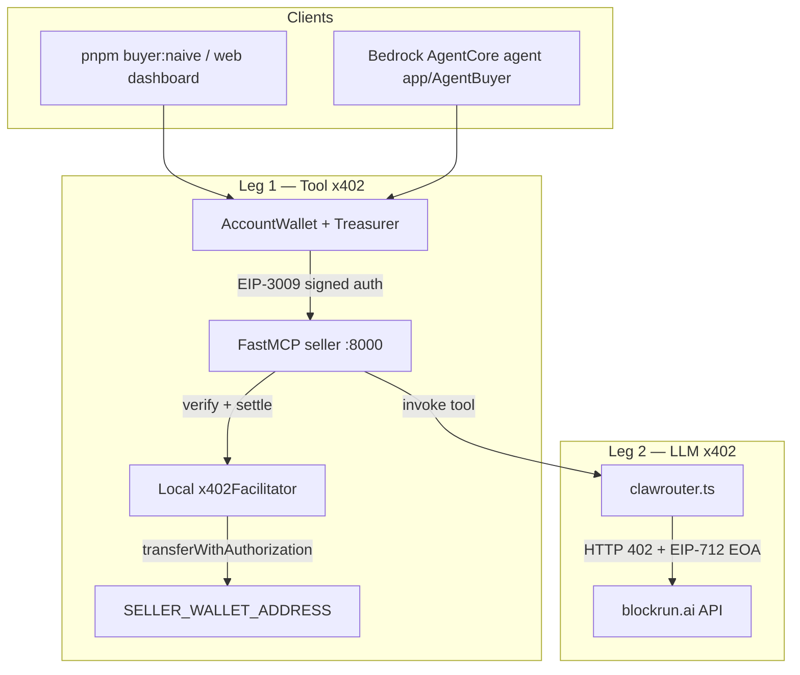

# AWS Bedrock AgentCore × Ampersend × BlockRun — Proof of Concept

TypeScript monorepo that connects **AWS Bedrock AgentCore** (optional deploy target), **Ampersend** x402 on **MCP** for paid tools, and **BlockRun** for LLM completions behind those tools. Two separate **x402** legs exist: **buyer → seller** (tool fees) and **seller → BlockRun** (LLM fees on Base mainnet).

---

## Contents

- [Architecture and data flow](#architecture-and-data-flow)
- [How each product fits](#how-each-product-fits)
- [Setup and testing](#setup-and-testing)
- [Environment variables](#environment-variables)
- [Scripts](#scripts)
- [AgentCore wallet (buyer)](#agentcore-wallet-buyer)
- [AgentCore deployment](#agentcore-deployment)
- [Troubleshooting](#troubleshooting)
- [Project structure](#project-structure)
- [Technologies](#technologies)
- [License](#license)

---

## Architecture and data flow

End-to-end, a user-facing client pays for **MCP tool calls** with an **Ampersend**-backed wallet; the **seller** process then pays **BlockRun** for the actual model call. **Amazon Bedrock** appears in **AgentCore project metadata**; **LLM text in this POC comes from BlockRun**, not from Bedrock `Converse` APIs.



| Step | What happens |
|------|----------------|
| 1 | Client uses **`createAgentCoreWallet()`** (CDP or `BUYER_PRIVATE_KEY` EOA) and a **treasurer** (`createNaiveTreasurer` or optional Ampersend API treasurer). |
| 2 | **MCP** connects to the **seller** (`withX402Payment`). The buyer signs an **EIP-3009 `transferWithAuthorization`** for **USDC** to **`SELLER_WALLET_ADDRESS`** (per `CHAIN_NETWORK`: Base Sepolia or Base mainnet). |
| 3 | The seller's **local `x402Facilitator`** (`@x402/evm ExactEvmSchemeV1`) **verifies** the buyer's signature on-chain, then **settles** by submitting `transferWithAuthorization` to the USDC contract. USDC moves from buyer to payee. The facilitator signer (`SELLER_PRIVATE_KEY`) pays gas (ETH). |
| 4 | Tool handlers call **`askClawRouter()`** in `packages/seller/src/clawrouter.ts`, which talks to **BlockRun** over HTTPS. |
| 5 | BlockRun returns **402 Payment Required**; the seller signs with a **separate funded EOA** ([ClawRouter-style](https://github.com/edgeandnode/ClawRouter/blob/main/src/x402.ts) **`signTypedData`**, x402 v2) using **`SELLER_BLOCKRUN_PRIVATE_KEY`** or **`SELLER_PRIVATE_KEY`**. BlockRun settles on **Base mainnet** USDC only for that leg. |

---

## How each product fits

### AWS AgentCore

- **Role:** Optional **runtime** for the TypeScript agent in `app/AgentBuyer` using [`bedrock-agentcore`](https://www.npmjs.com/package/bedrock-agentcore) (`BedrockAgentCoreApp`).
- **Config:** `agentcore/agentcore.json` registers **AgentCore Runtime**, **container** build, and **`modelProvider`**. The sample **maps prompts to MCP tool names** and calls the **seller MCP** (same wallet pattern as local buyers).
- **Networking:** For cloud runs, set **`SELLER_URL`** to a **public** seller MCP URL; `http://localhost:8000/mcp` is for local dev only.

### Amazon Bedrock

- **Role:** Declared as **`modelProvider`: `"Bedrock"`** in `agentcore.json` so deployments align with [Bedrock AgentCore](https://docs.aws.amazon.com/bedrock-agentcore/).
- **In this repo:** **`agent.ts` does not call Bedrock `Converse` (or other chat APIs)** for tool completions. Adding in-process Bedrock reasoning would be an extension; **tool text is produced by BlockRun** inside the seller.

### Ampersend

- **Role:** **x402** on **MCP** (and HTTP in other samples): **`withX402Payment`** on the server, **`AccountWallet` + treasurers** on clients.
- **In this repo:** Seller **`packages/seller`**, buyers **`packages/buyer`**, web **`packages/web`**. See [Ampersend SDK](https://github.com/edgeandnode/ampersend-sdk).

### BlockRun

- **Role:** Paid **OpenAI-compatible** API at `https://blockrun.ai/api` (e.g. `/v1/chat/completions`), gated by **x402**.
- **In this repo:** `packages/seller/src/clawrouter.ts` implements the same **EOA EIP-712** pattern as [ClawRouter `x402.ts`](https://github.com/edgeandnode/ClawRouter/blob/main/src/x402.ts). **Ampersend `SmartAccountWallet` / ERC-1271** payloads are **not** compatible with BlockRun's on-chain verifier—use a **funded EOA** for the BlockRun leg.

---

## Setup and testing

### Prerequisites

- **Node.js 20+** and **pnpm** (see root `package.json` → `packageManager`)
- **USDC** on the right chain for **buyer** (tool leg) and **BlockRun EOA** (mainnet leg); see below
- **Docker** — only if you build the AgentBuyer container

### 1. Install and env

```bash
git clone <repo-url>
cd aws-agentcore-ampersend
pnpm install
cp .env.example .env
```

Edit **`.env`** at the **repository root** (all scripts load it from there). Minimum for a local run:

| Goal | Set |
|------|-----|
| Buyer signs tools | **`BUYER_PRIVATE_KEY`** *or* full **CDP** (`CDP_API_KEY_ID`, `CDP_API_KEY_SECRET`, `CDP_WALLET_SECRET`) |
| Seller receives tool payments | **`SELLER_WALLET_ADDRESS`** |
| BlockRun LLM calls | **`SELLER_PRIVATE_KEY`** (EOA that pays BlockRun) *or* **`SELLER_BLOCKRUN_PRIVATE_KEY`** if you split keys |
| Model id | **`CLAWROUTER_MODEL`** (e.g. `claude-haiku-4.5`) |
| Network for buyer↔seller | **`CHAIN_NETWORK`** — `base-sepolia` (testnet) or `base` (mainnet real USDC) |

BlockRun's settlement in this flow uses **Base mainnet** USDC. Fund the **address derived from `SELLER_PRIVATE_KEY` / `SELLER_BLOCKRUN_PRIVATE_KEY`** on [Base mainnet USDC](https://basescan.org/token/0x833589fCD6eDb6E08f4c7C32D4f71b54bdA02913).

### 2. Fund wallets

- **Tool leg (buyer):** Fund the **buyer** (CDP address or `BUYER_PRIVATE_KEY` EOA) with **USDC** on the chain **`CHAIN_NETWORK`** points to.
- **Tool leg (facilitator gas):** The seller's local facilitator submits `transferWithAuthorization` on-chain; this costs gas. Fund the **`SELLER_PRIVATE_KEY`** (or **`SELLER_BLOCKRUN_PRIVATE_KEY`**) EOA with a small amount of **ETH** on the **`CHAIN_NETWORK`** chain. A convenience script is included:

```bash
pnpm --filter @poc/buyer exec tsx ../../scripts/fund-facilitator.ts
```

This sends **0.0003 ETH** from the buyer wallet to the facilitator signer (enough for hundreds of settlements on Base).

- **BlockRun leg:** Fund the **BlockRun EOA** (from seller keys above) with **Base mainnet USDC**. Without balance here, tools return **`PAYMENT_INVALID`** from BlockRun even when MCP x402 succeeds.

### 3. Run the seller

```bash
pnpm seller:dev
```

Expect: **`[seller] Local x402 facilitator ready`**, **`[seller] FastMCP server listening on http://localhost:8000/mcp`**, and the tool list in logs.

### 4. Run a buyer (integration test)

In a **second** terminal:

```bash
pnpm buyer:naive
```

**Success:** For each tool, logs show **`[agentcore-wallet] Payment …: sending`** then **`accepted`**, and JSON results include a real settlement with **transaction hash**:

```json
"_meta": {
  "x402/payment-response": {
    "success": true,
    "transaction": "0x565aa01f...",
    "network": "base",
    "payer": "0x717520C8..."
  }
}
```

The seller logs show **`settled ✓ tx: 0x...`** for each tool call. Verify on BaseScan under the payee's [token transfers](https://basescan.org/address/<SELLER_WALLET_ADDRESS>#tokentxns).

### 5. Optional checks

```bash
pnpm recent-txs    # BaseScan links for env addresses (after activity)
pnpm web:dev       # Dashboard at http://localhost:3000 (builds @poc/buyer first)
```

**Dashboard:** Patterns **naive** / **ampersend** use `POST /api/invoke` with the same wallet path as `pnpm buyer:naive`. Pattern **proxy** needs **`pnpm buyer:proxy`** and matching **`PROXY_URL`**.

**Full compile:** `pnpm -r build` (seller, buyer, web, AgentBuyer).

---

## Environment variables

| Variable | Purpose |
|----------|---------|
| `CDP_API_KEY_ID`, `CDP_API_KEY_SECRET`, `CDP_WALLET_SECRET` | Coinbase CDP / AgentKit (optional vs `BUYER_PRIVATE_KEY`) |
| `CDP_WALLET_ADDRESS` | Optional fixed CDP EVM address |
| `BUYER_PRIVATE_KEY` | Local EOA when not using full CDP |
| `SELLER_WALLET_ADDRESS` | Address that **receives** MCP tool x402 payments |
| `SELLER_PRIVATE_KEY` | **EOA** private key — used as the **local x402 facilitator signer** (needs ETH for gas on `CHAIN_NETWORK`) and as the **BlockRun payer** (needs Base mainnet USDC), unless `SELLER_BLOCKRUN_PRIVATE_KEY` is set |
| `SELLER_BLOCKRUN_PRIVATE_KEY` | Optional separate EOA **only** for BlockRun; if set, this key pays BlockRun and also serves as the facilitator signer |
| `CHAIN_NETWORK` | `base-sepolia` or `base` (buyer↔seller leg) |
| `CLAWROUTER_MODEL` | BlockRun model id (e.g. `claude-haiku-4.5`) |
| `SELLER_URL` | Seller MCP URL (default `http://localhost:8000/mcp`; set for AgentCore in AWS) |
| `PROXY_URL` | MCP proxy for dashboard proxy pattern (default port 8402) |
| `AMPERSEND_SPEND_LIMIT_TREASURER` | `1` only for `pnpm buyer:mcp` + smart-account env vars |

Copy **`.env.example`** as a template; never commit real secrets.

---

## Scripts

| Script | Description |
|--------|---------------|
| `pnpm seller:dev` | FastMCP seller + local x402 facilitator + BlockRun in tools |
| `pnpm buyer:naive` | MCP client: AgentCore wallet + NaiveTreasurer |
| `pnpm buyer:mcp` | MCP buyer with optional spend-limit treasurer |
| `pnpm buyer:http` | HTTP x402 sample |
| `pnpm buyer:proxy` | MCP proxy (for dashboard **proxy** pattern) |
| `pnpm web:dev` | Next.js dashboard |
| `pnpm recent-txs` | Recent tx links for env wallets |
| `pnpm build` | `pnpm -r build` across packages |

---

## AgentCore wallet (buyer)

Implementation: `packages/buyer/src/agentcore-wallet.ts`, CDP bridge: `cdp-viem-account.ts`. **`CdpEvmWalletProvider`** is wrapped with viem **`toAccount()`** so **`AccountWallet`** can sign x402.

**Import in other packages** (after `pnpm --filter @poc/buyer build`):

```typescript
import { createAgentCoreWallet } from "@poc/buyer/agentcore-wallet";
```

Production: load CDP secrets from **AWS Secrets Manager** or AgentCore env, not git.

---

## AgentCore deployment

- Build buyer first: **`pnpm --filter @poc/buyer build`** (web `predev`/`build` does this for the app).
- **Docker** from repo root: `docker build -f app/AgentBuyer/Dockerfile .`
- `agentcore/agentcore.json` may list **Python placeholders**; the container runs the **Node** agent. See [AgentCore TypeScript runtime](https://docs.aws.amazon.com/bedrock-agentcore/latest/devguide/runtime-get-started-cli-typescript.html).

---

## Troubleshooting

| Symptom | Likely cause |
|---------|----------------|
| MCP 402 / buyer payment fails | Wrong **`CHAIN_NETWORK`** or unfunded **buyer** USDC |
| **`PAYMENT_INVALID`** / ClawRouter 402 on tool result | **BlockRun EOA** has **no Base mainnet USDC**, or wrong model in **`CLAWROUTER_MODEL`** |
| `invalid_exact_evm_missing_eip712_domain` | Requirements missing `extra: { name, version }` — already set in `makeRequirements`; verify USDC EIP-712 domain matches |
| Settlement fails / facilitator out of gas | **`SELLER_PRIVATE_KEY`** EOA needs **ETH** on `CHAIN_NETWORK` for gas; run `scripts/fund-facilitator.ts` |
| `No facilitator configured` | Set **`SELLER_PRIVATE_KEY`** or **`SELLER_BLOCKRUN_PRIVATE_KEY`** in `.env` |
| Payments "accepted" but no on-chain USDC | Seller must show **`[seller] Local x402 facilitator ready`** at startup; if missing, the key is not set |
| BlockRun rejects "smart" signatures | BlockRun expects **ClawRouter EOA EIP-712**; fund the **EOA** from seller keys, not only a smart account |
| CDP not used | All three `CDP_*` vars set; remove stray **`BUYER_PRIVATE_KEY`** if you want CDP-only |
| Web build errors on `@poc/buyer` | Run **`pnpm --filter @poc/buyer build`** |

---

## Project structure

```
aws-agentcore-ampersend/
├── packages/
│   ├── seller/src/          # FastMCP, x402Facilitator, withX402Payment, clawrouter.ts → BlockRun
│   ├── buyer/src/           # AgentCore wallet, naive-buyer, mcp-buyer, proxy, http-buyer
│   └── web/                 # Next.js dashboard, /api/invoke
├── app/AgentBuyer/          # BedrockAgentCoreApp + @poc/buyer
├── agentcore/               # AgentCore CLI metadata
├── scripts/
│   ├── recent-tx-links.ts   # BaseScan links for env wallet addresses
│   └── fund-facilitator.ts  # Send gas ETH to the facilitator signer
├── .env.example
└── README.md
```

---

## Technologies

- [Amazon Bedrock](https://docs.aws.amazon.com/bedrock/) — foundation models; **`modelProvider`** in AgentCore config
- [Amazon Bedrock AgentCore](https://docs.aws.amazon.com/bedrock-agentcore/) — runtime; [`bedrock-agentcore`](https://www.npmjs.com/package/bedrock-agentcore)
- [Ampersend SDK](https://github.com/edgeandnode/ampersend-sdk) — x402 MCP/HTTP
- [BlockRun](https://blockrun.ai/) — LLM API; [ClawRouter](https://github.com/edgeandnode/ClawRouter) — reference x402 client
- [x402](https://github.com/coinbase/x402) ([@x402/core](https://www.npmjs.com/package/@x402/core), [@x402/evm](https://www.npmjs.com/package/@x402/evm) — local facilitator), [Coinbase CDP](https://docs.cdp.coinbase.com/) + [AgentKit](https://docs.cdp.coinbase.com/agent-kit/docs/welcome), [Next.js](https://nextjs.org), [viem](https://viem.sh)

---

## License

Add a `LICENSE` file at the repository root if you distribute this project.
